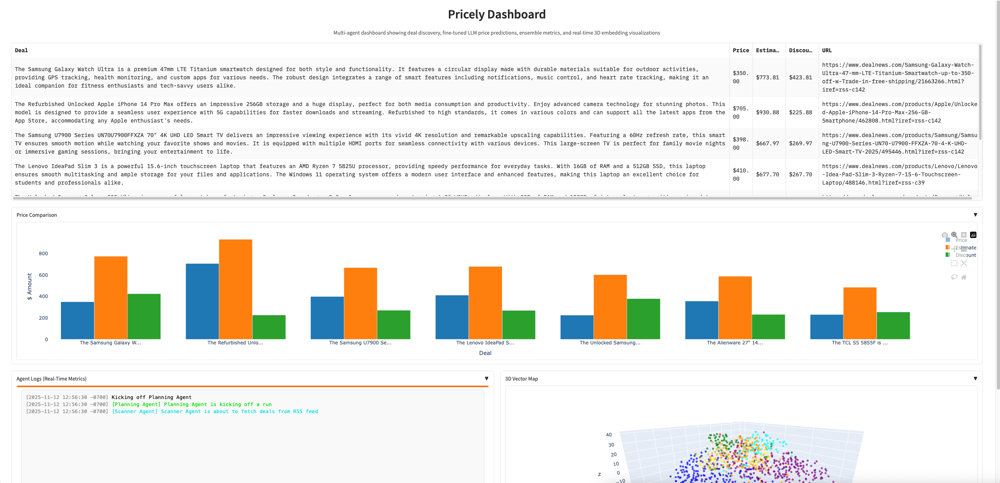
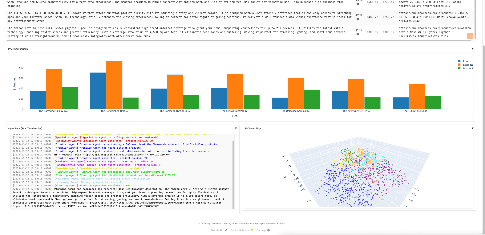
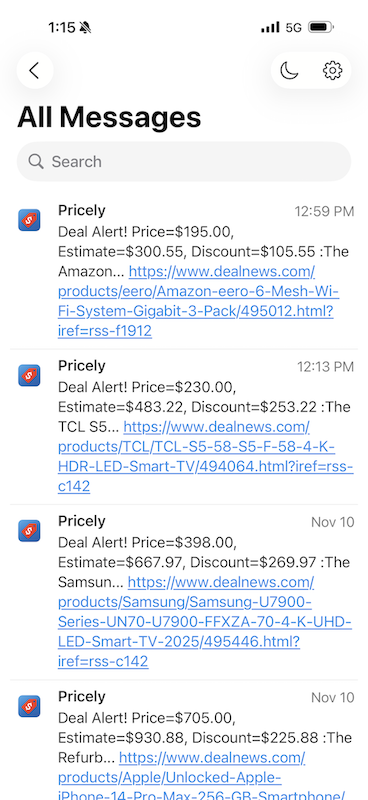

# Pricely

Pricely is an agentic AI system, a multi-agent, LLM-driven pricing and deal discovery assistant built with Python, Gradio, ChromaDB**, OpenAI, and Ollama. It demonstrates a complete AI pipeline that includes data collection, model fine-tuning, agent coordination, and real-time visualization.

At its core, Pricely features a custom fine-tuned price estimation model trained and deployed on Hugging Face and Modal, with training tracked using Weights & Biases. The project showcases how multiple specialized agents can collaborate autonomously to identify, estimate, and alert users about high-value product deals in real time, demonstrating fully agentic behavior and autonomous decision-making.

## Model Card and Training

### Fine-Tuned Price Estimator (Specialist Agent)
The Specialist Agent runs a fine-tuned model trained to predict item prices based on textual descriptions. Training was performed on a structured dataset of product listings using transfer learning and OpenAI embeddings.

- **Model:** `jordanmatsumoto/pricing-specialist` ([View on Hugging Face](https://huggingface.co/jordanmatsumoto/pricing-specialist))  
- **Training Platform:** Weights & Biases ([View Training Report](https://api.wandb.ai/links/jordanmatsumoto-independent/ydvsd9sg))  
- **Deployment:** Hosted remotely on Modal (`modal.Cls.from_name("pricer-service", "Pricer")`)  
- **Training Curve:**  
  
*Training was completed across three sequential runs due to system timeouts, with all runs tracked and merged in Weights & Biases to produce the final metrics curve shown above.*

## Screenshots

  
*Monitor real-time deals, predictions, and embedding visualizations through a clean, interactive Gradio interface.*

## Demo

### 1. View Deal Estimates
**Workflow:**  
- `ScannerAgent` fetches recent deals from RSS feeds.  
- `EnsembleAgent` predicts item prices using the Specialist (fine-tuned LLM), Frontier (RAG-based model), and Random Forest agents.  
- `PlanningAgent` identifies deals with significant discounts.  

**Result:**  
  
*Displays product, actual price, estimated price, and discount in a grouped bar chart.*

### 2. 3D Product Embeddings
**Visualization:**  
- High-dimensional embeddings reduced with TSNE.  
- Products plotted in 3D, color-coded by category.  

**Result:**  
  
*Visualizes product similarity and clustering within the vector space.*

### 3. Push Notification Alert
**Workflow:**  
- Significant deals trigger push alerts through Pushover.  
- Registered devices receive real-time notifications directly from Pricely.  

**Result:**  
  
*Receive instant notifications on your device when high-value deals are detected.*

## Project Overview

- **Type:** Deal Discovery and Pricing AI System  
- **Architecture:** Multi-Agent (Agentic) Framework  
- **Core Technologies:** Gradio, ChromaDB, OpenAI, Modal, Scikit-learn  
- **Objective:** Identify profitable deals using fine-tuned and ensemble models  
- **UI Features:** Charts, tables, embeddings, and live agent logs  

## Features

- **Multi-Agent Collaboration:** Specialist (fine-tuned LLM), Frontier (RAG model), and Random Forest agents combined through an Ensemble Agent.  
- **Automated Deal Scanner:** Extracts and structures new deals using OpenAI-based summarization.  
- **Fine-Tuned Model Inference:** Specialist LLM fine-tuned with Ollama (Meta-Llama-3.1-8B) for structured price prediction and hosted on Modal for remote predictions.  
- **Price Estimation Ensemble:** Combines agent outputs through weighted linear regression.  
- **Discount Planning:** Computes and ranks deals by relative savings.  
- **Push Notifications:** Sends alerts via Pushover; SMS notifications via Twilio are included in the code but disabled by default.  
- **3D Visualization:** Displays embedding clusters using Plotly’s interactive 3D TSNE.  
- **Real-Time Logs:** Monitors agent activity through the Gradio dashboard.  

## Controls

- **Run Dashboard:** Start the Gradio app and automatically scan for new deals.  
- **Select Deal:** Click a table entry to trigger deal notifications.  
- **View Charts:** Compare actual and estimated prices or explore embeddings.  
- **Monitor Logs:** Track live agent execution.  

## How Pricely Works

### Deal Collection
- **ScannerAgent** retrieves and deduplicates new deals using memory tracking.  
- Descriptions are summarized and standardized through OpenAI.

### Price Estimation
- **Specialist Agent:** Fine-tuned LLM (Ollama, Meta-Llama-3.1-8B) hosted on Modal.
- **Frontier Agent:** Context-aware estimator using RAG and GPT-4o-mini.
- **Random Forest Agent:** Embedding-based price predictor.
- **Ensemble Agent:** Combines all predictions through linear regression.

### Planning and Alerts
- **PlanningAgent** computes discounts for each deal.  
- **MessagingAgent** sends alerts when the discount threshold is exceeded.

### Visualization
- **Bar Chart:** Displays prices and estimated values.  
- **3D Embeddings:** Shows product relationships and clusters.  
- **Real-Time Logs:** Displays continuous agent updates.

### Gradio Interface
- Integrated layout combining tables, plots, and logs.  
- Auto-refresh for live monitoring and updates.
  
## Installation

1. **Clone the repository**
```bash
git clone https://github.com/jordanmatsumoto/pricely.git
```

2. **Change directory**
```bash
cd pricely
```

3. **Install dependencies**
```bash
pip install -r requirements.txt
```

4. **Set up your environment variables**  
Create a .env file in the project root and add:
```bash
OPENAI_API_KEY=your-openai-key
PUSHOVER_USER=your-pushover-user
PUSHOVER_TOKEN=your-pushover-token
```

5. **Run the dashboard**
```bash
python pricely.py
```

6. **Open the Gradio interface**  
A local URL (and optional public URL) will appear in the console.
